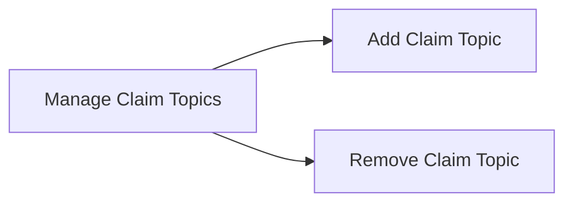

# Claim Topic Registry

Manage Claim Topics

- Add Claim Topic
- Remove Claim Topic

## User Interface

The Claim Topic Registry is administered by the Root Authority. The following UI pages are available:

- Add Claim Topic

- Add a new claim topic

- Remove Claim Topic

- Remove an existing claim topic

## Mermaid Diagram

## React Page Components

### Add Claim Topic

The Add Claim Topic page allows the Root Authority to add a new claim topic.

### Remove Claim Topic

The Remove Claim Topic page allows the Root Authority to remove an existing claim topic.

## Claim Topics List

The Claim Topics List page allows the Root Authority to view the list of claim topics.

## UI Implmentation

The claim topics UI consists of a single page. The page contains a list of the currently-existing claim topics. The page also contains a button to add a new claim topic and a button to remove an existing claim topic. The claim topics list items each contain a checkbox that can be used to select the claim topic for removal. If multiple claim topics are selected, then the remove button will remove all of the selected claim topics. Clicking on the add claim topic button will open a dialog that allows the user to enter the claim topic to add. Clicking on the remove claim topic button will open a dialog that allows the user to confirm the removal of the selected claim topics.

The UI is implemented using React with Tailwind CSS and Ant.design. The Component hierarchy for the claim topics UI is as follows:

- ClaimTopicsPage
    - ClaimTopicsList
        - ClaimTopicListItem
    - AddClaimTopicDialog
    - RemoveClaimTopicDialog

For the claim topics list, we use a grid layout with a single column. The grid layout is implemented using the Ant.design Grid component. The grid layout is responsive and will display the claim topics list in a single column on mobile devices and in multiple columns on larger devices.

The claim topics list is implemented using the Ant.design List component. The list items are implemented using the Ant.design List.Item component. The list items contain a checkbox that can be used to select the claim topic for removal. The list items also contain a button that can be used to remove the claim topic. The list items are implemented using the Ant.design List.Item component. The list items contain a checkbox that can be used to select the claim topic for removal. The list items also contain a button that can be used to remove the claim topic.