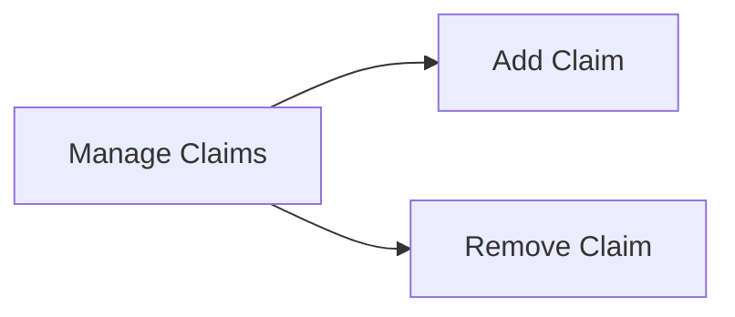

# Claims Registry

Manage Claims

- Add Claim
- Remove Claim

## User Interface

The Claims Registry is administered by the Root Authority. The following UI pages are available:

- Add Claim

- Add a new claim

- Remove Claim

- Remove an existing claim

## Mermaid Diagram

## React Page Components

### Add Claim

The Add Claim page allows a trusted issuer to add a new claim.

### Remove Claim

The Remove Claim page allows a trusted issuer to remove an existing claim.

## Claims List

The Claims List page allows a trusted issuer to view the list of claims.

## UI Implmentation

The claims UI consists of a single page. The page contains a list of the currently-existing claims. The page also contains a button to add a new claim and a button to remove an existing claim. The claims list items each contain a checkbox that can be used to select the claim for removal. If multiple claims are selected, then the remove button will remove all of the selected claims. Clicking on the add claim button will open a dialog that allows the user to enter the claim to add. Clicking on the remove claim button will open a dialog that allows the user to confirm the removal of the selected claims.

The UI is implemented using React with Tailwind CSS and Ant.design. The Component hierarchy for the claims UI is as follows:

- ClaimsPage
    - ClaimsList
        - ClaimListItem
    - AddClaimDialog
    - RemoveClaimDialog

For the claims list, we use a grid layout with a single column. The grid layout is implemented using the Ant.design Grid component. The grid layout is responsive and will display the claims list in a single column on mobile devices and in multiple columns on larger devices.

The claims list is implemented using the Ant.design List component. The list items are implemented using the Ant.design List.Item component. The list items contain a checkbox that can be used to select the claim for removal. The list items also contain a button that can be used to remove the claim. The list items are implemented using the Ant.design List.Item component. The list items contain a checkbox that can be used to select the claim for removal. The list items also contain a button that can be used to remove the claim.