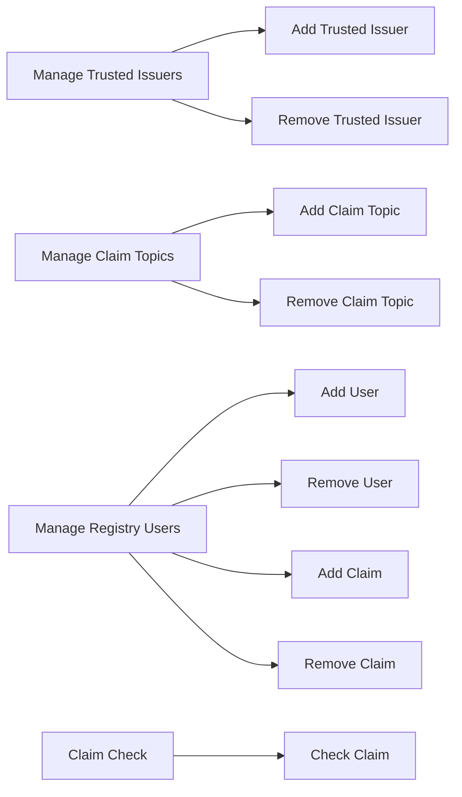

# Application Design

## Overview

The application is a registry of trusted issuers and registry users. The registry is a smart contract that is deployed on the Ethereum blockchain. The registry is owned by the root authority. The root authority is the only entity that can add or remove trusted issuers. The root authority is also the only entity that can add or remove claim topics. Trusted issuers are entities that are trusted to issue claims. Trusted issuers are added by the root authority. Trusted issuers can add or remove users from the registry. Trusted issuers can also add or remove claims from users. Registry users are entities that can have claims issued to them. Registry users are added by trusted issuers. Trusted issuers can also remove registry users. Trusted issuers can also add or remove claims from registry users. The registry is a smart contract that is deployed on the Ethereum blockchain. The registry is owned by the root authority. The root authority is the only entity that can add or remove trusted issuers. The root authority is also the only entity that can add or remove claim topics. Trusted issuers are entities that are trusted to issue claims. Trusted issuers are added by the root authority. Trusted issuers can add or remove users from the registry. Trusted issuers can also add or remove claims from users. Registry users are entities that can have claims issued to them. Registry users are added by trusted issuers. Trusted issuers can also remove registry users. Trusted issuers can also add or remove claims from registry users.

## Claim Topic Registry

Manage Claim Topics
- Add Claim Topic
- Remove Claim Topic

## Trusted Issuers Registry

Manage Trusted Issuers
- Add Trusted Issuer
- Remove Trusted Issuer

Manage Claim Topics
- Add Claim Topic
- Remove Claim Topic


## Identity Registry

Manage Registry Users

- Trusted Issuer adds a new user to the registry
- Trusted Issuer removes a user from the registry
- Truster Issuer adds a claim to a user
- Trusted Issuer removes a claim from a user

Claim Check
- Check Claim for a user

## Mermaid Diagram



## The Root Authority

The root authority is defined as the owner of the registry. The root authority is the only entity that can add or remove trusted issuers. The root authority is also the only entity that can add or remove claim topics.


## Claim Topic Registry

Claim topics are the topics that a trusted issuer can issue claims for. The root authority can add or remove claim topics. The root authority can also check if a claim topic exists.

```solidity
interface IClaimTopicsRegistry {

    // events
    event ClaimTopicAdded(uint256 indexed claimTopic);
    event ClaimTopicRemoved(uint256 indexed claimTopic);

    // functions
    // setters
    function addClaimTopic(uint256 _claimTopic) external;
    function removeClaimTopic(uint256 _claimTopic) external;

    // getter
    function getClaimTopics() external view returns (uint256[] memory);

    // role setter
    function transferOwnershipOnClaimTopicsRegistryContract(address _newOwner) external;
}
```

The above interface allows the root authority to add or remove claim topics. The root authority can also check if a claim topic exists.


## Trusted Issuer Registry

Trusted issuers are entities that are trusted to issue claims. Trusted issuers are added by the root authority. Trusted issuers can add or remove users from the registry. Trusted issuers can also add or remove claims from users.

```solidity
interface ITrustedIssuersRegistry {

    // events
    event TrustedIssuerAdded(IClaimIssuer indexed trustedIssuer, uint[] claimTopics);
    event TrustedIssuerRemoved(IClaimIssuer indexed trustedIssuer);
    event ClaimTopicsUpdated(IClaimIssuer indexed trustedIssuer, uint[] claimTopics);

    // functions
    // setters
    function addTrustedIssuer(IClaimIssuer _trustedIssuer, uint[] calldata _claimTopics) external;
    function removeTrustedIssuer(IClaimIssuer _trustedIssuer) external;
    function updateIssuerClaimTopics(IClaimIssuer _trustedIssuer, uint[] calldata _claimTopics) external;

    // getters
    function getTrustedIssuers() external view returns (IClaimIssuer[] memory);
    function isTrustedIssuer(address _issuer) external view returns(bool);
    function getTrustedIssuerClaimTopics(IClaimIssuer _trustedIssuer) external view returns(uint[] memory);
    function hasClaimTopic(address _issuer, uint _claimTopic) external view returns(bool);

}
```

The above interface allows the root authority to add or remove trusted issuers. The root authority can also update the claim topics for a trusted issuer. The root authority can also check if an address is a trusted issuer and get the claim topics for a trusted issuer.


## Identity Registry

Registry users are entities that can have claims issued to them. Registry users are added by trusted issuers. Trusted issuers can also remove registry users. Trusted issuers can also add or remove claims from registry users.

```solidity
interface IIdentity is IERC734 {}

interface IIdentityRegistry {
    // events
    event IdentityAdded(address indexed identity);
    event IdentityRemoved(address indexed identity);
    event IdentityCountryUpdated(address indexed identity, uint16 indexed country);
    event ClaimAdded(address indexed identity, uint256 indexed claimTopic, bytes claim);
    event ClaimRemoved(address indexed identity, uint256 indexed claimTopic);

    // functions
    function addIdentity(address _identity, IIdentity identityData) external;
    function batchAddIdentity(address[] calldata _identities, IIdentity[] calldata identityDatas) external;
    function removeIdentity(address _identity) external;
    function addClaim(address _identity, uint256 _claimTopic, bytes calldata _claim) external;
    function removeClaim(address _identity, uint256 _claimTopic) external;

    // registry consultation
    function contains(address _userAddress) external view returns (bool);
    function isVerified(address _userAddress) external view returns (bool);
    function identity(address _userAddress) external view returns (IIdentity);

    // getters
    function getRegistryUsers() external view returns (address[] memory);
    function isRegistryUser(address _registryUser) external view returns(bool);
    function getClaims(address _registryUser) external view returns(uint256[] memory);
    function getClaim(address _registryUser, uint256 _claimTopic) external view returns(bytes memory);
    function hasClaim(address _registryUser, uint256 _claimTopic) external view returns(bool);

    function getOnchainIDFromWallet(address _userAddress) external view returns (bytes32);
    function walletLinked(bytes32 _onchainID) external view returns (bool);
    function unlinkWallet(bytes32 _onchainID) external;
    function unlinkWalletAddress(address _walletAddress) external;
    function walletAddressLinked(address _walletAddress) external view returns (bool);
}
```

The above interface allows trusted issuers to add or remove registry users. Trusted issuers can also add or remove claims from registry users. The above interface also allows anyone to check if an address is a registry user. The above interface also allows anyone to check if a registry user has a claim. The above interface also allows anyone to get the claims for a registry user.