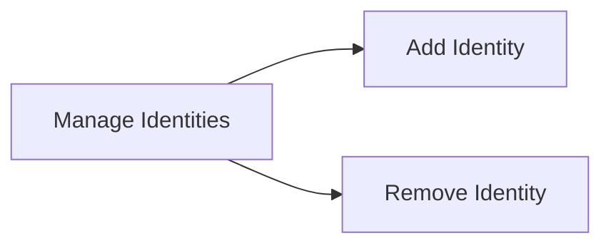

# Identities Registry

Manage Identities
- Add Identity
- Remove Identity

## Mermaid Diagram



## The Root Authority

The root authority is defined as the owner of the registry. The root authority is the only entity that can add or remove identities.

## Identities Registry

Identities are the entities that can issue claims. The root authority can add or remove identities. The root authority can also check if an identity exists.

```solidity
interface IIdentityRegistry {
    // events
    event IdentityAdded(address indexed _address, IIdentity identity);
    event IdentityRemoved(address indexed _address, IIdentity identity);
    event IdentityCountryUpdated(address indexed identity, uint16 indexed country);
    event ClaimAdded(address indexed identity, uint256 indexed claimTopic, bytes claim);
    event ClaimRemoved(address indexed identity, uint256 indexed claimTopic);
    event WalletLinked(address indexed walletAddress, bytes32 indexed onchainID);
    event WalletUnlinked(address indexed walletAddress, bytes32 indexed onchainID);

    // functions
    function addIdentity(address _identity, IIdentity identityData) external;
    function batchAddIdentity(address[] calldata _identities, IIdentity[] calldata identityDatas) external;
    function removeIdentity(address _identity) external;
    function addClaim(address _identity, uint256 _claimTopic, bytes calldata _claim) external;
    function removeClaim(address _identity, uint256 _claimTopic) external;

    // registry consultation
    function contains(address _userAddress) external view returns (bool);
    function isVerified(address _userAddress) external view returns (bool);
    function identity(address _userAddress) external view returns (IIdentity);

    // getters
    function getRegistryUsers() external view returns (address[] memory);
    function isRegistryUser(address _registryUser) external view returns(bool);
    function getClaims(address _registryUser) external view returns(uint256[] memory);
    function getClaim(address _registryUser, uint256 _claimTopic) external view returns(bytes memory);
    function hasClaim(address _registryUser, uint256 _claimTopic) external view returns(bool);

    function getOnchainIDFromWallet(address _userAddress) external view returns (bytes32);
    function walletLinked(bytes32 _onchainID) external view returns (bool);
    function unlinkWallet(bytes32 _onchainID) external;
    function unlinkWalletAddress(address _walletAddress) external;
    function walletAddressLinked(address _walletAddress) external view returns (bool);
}
```

## React Page Components

### Add Identity

The Add Identity page allows the Root Authority to add a new identity.

### Remove Identity

The Remove Identity page allows the Root Authority to remove an existing identity.

### Edit Identity Country

The Edit Identity Country page allows the Root Authority to edit the country for an existing identity.

(adding and removing claims is handled in another section)

## Identities List

The Identities List page allows the Root Authority to view the list of identities.

## UI Implmentation

The identities UI consists of a single page. The page contains a list of the currently-existing identities. The page also contains a button to add a new identity and a button to remove an existing identity. The identities list items each contain a checkbox that can be used to select the identity for removal. If multiple identities are selected, then the remove button will remove all of the selected identities. Clicking on the add identity button will open a dialog that allows the user to enter the identity to add. Clicking on the remove identity button will open a dialog that allows the user to confirm the removal of the selected identities.

The UI is implemented using React with Tailwind CSS and Ant.design. The Component hierarchy for the identities UI is as follows:

- IdentitiesPage
    - IdentitiesList
        - IdentityListItem
    - AddIdentityDialog
    - RemoveIdentityDialog
    - EditIdentityCountryDialog

For the identities list, we use a grid layout with a single column. The grid layout is implemented using the Ant.design Grid component. The grid layout is responsive and will display the identities list in a single column on mobile devices and in multiple columns on larger devices.

The identities list is implemented using the Ant.design List component. The list items are implemented using the Ant.design List.Item component. The list items contain a checkbox that can be used to select the identity for removal. The list items also contain a button that can be used to remove the identity. The list items are implemented using the Ant.design List.Item component. The list items contain a checkbox that can be used to select the identity for removal. The list items also contain a button that can be used to remove the identity.

