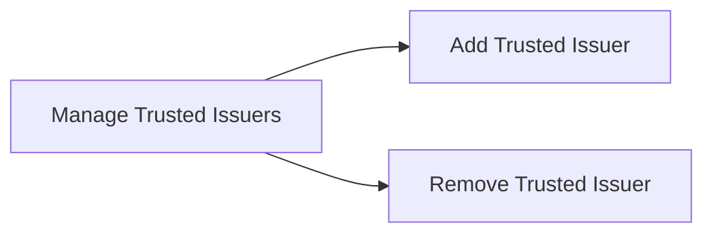

# Trusted Issuer Registry

Manage Trusted Issuers
- Add Trusted Issuer
- Remove Trusted Issuer
- Edit Trusted Issuer Claim Topics

## Mermaid Diagram



## The Root Authority

The root authority is defined as the owner of the registry. The root authority is the only entity that can add or remove trusted issuers. The root authority is also the only entity that can add or remove claim topics.

## Trusted Issuer Registry

Trusted issuers are the entities that can issue claims. The root authority can add or remove trusted issuers. The root authority can also check if a trusted issuer exists.

```solidity
interface ITrustedIssuersRegistry {

    // events
    event TrustedIssuerAdded(IClaimIssuer indexed trustedIssuer, uint[] claimTopics);
    event TrustedIssuerRemoved(IClaimIssuer indexed trustedIssuer);
    event ClaimTopicsUpdated(IClaimIssuer indexed trustedIssuer, uint[] claimTopics);

    // functions
    // setters
    function addTrustedIssuer(IClaimIssuer _trustedIssuer, uint[] calldata _claimTopics) external;
    function removeTrustedIssuer(IClaimIssuer _trustedIssuer) external;
    function updateIssuerClaimTopics(IClaimIssuer _trustedIssuer, uint[] calldata _claimTopics) external;

    // getters
    function getTrustedIssuers() external view returns (IClaimIssuer[] memory);
    function isTrustedIssuer(address _issuer) external view returns(bool);
    function getTrustedIssuerClaimTopics(IClaimIssuer _trustedIssuer) external view returns(uint[] memory);
    function hasClaimTopic(address _issuer, uint _claimTopic) external view returns(bool);

}
```

## React Page Components

### Add Trusted Issuer

The Add Trusted Issuer page allows the Root Authority to add a new trusted issuer.

### Edit Trusted Issuer Claim Topics

The Edit Trusted Issuer Claim Topics page allows the Root Authority to edit the claim topics for an existing trusted issuer.

### Remove Trusted Issuer

The Remove Trusted Issuer page allows the Root Authority to remove an existing trusted issuer.

## Trusted Issuers List

The Trusted Issuers List page allows the Root Authority to view the list of trusted issuers.

## UI Implmentation

The trusted issuers UI consists of a single page. The page contains a list of the currently-existing trusted issuers. The page also contains a button to add a new trusted issuer and a button to remove an existing trusted issuer. The trusted issuers list items each contain a checkbox that can be used to select the trusted issuer for removal. If multiple trusted issuers are selected, then the remove button will remove all of the selected trusted issuers. Clicking on the add trusted issuer button will open a dialog that allows the user to enter the trusted issuer to add. Both the add and the edit dialogs allow the user to select the claim topics for the trusted issuer from the full list of claim topics. Clicking on the remove trusted issuer button will open a dialog that allows the user to confirm the removal of the selected trusted issuers.

The UI is implemented using React with Tailwind CSS and Ant.design. The Component hierarchy for the claim topics UI is as follows:

- TrustedIssuersPage
    - TrustedIssuersList
        - TrustedIssuerListItem
    - AddTrustedIssuerDialog
    - EditTrustedIssuerClaimTopicsDialog
    - RemoveTrustedIssuerDialog

For the trusted issuers list, we use a grid layout with a single column. The grid layout is implemented using the Ant.design Grid component. The grid layout is responsive and will display the trusted issuers list in a single column on mobile devices and in multiple columns on larger devices. We also use the grid in the add / edit Trusted Issuer dialogs to show the claim topics.

